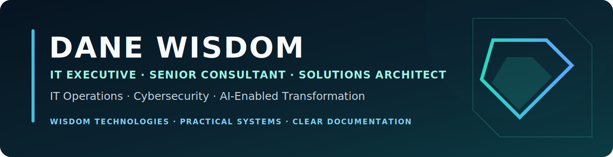

# Hi, I'm Dane Wisdom

**IT Executive · Senior Consultant · Solutions Architect · Founder, Wisdom Technologies**

I design, modernize, and operationalize dependable technology systems. My work spans IT advisory, cloud and infrastructure, cybersecurity, networking, automation, software engineering, AI-enabled workflows, and technical documentation.

## What I’m building

- **[Wisdom IT Readiness Toolkit](https://github.com/danwiz/wisdom-it-readiness-toolkit)** — a released open-source assessment toolkit with weighted scoring, maturity classification, Markdown reporting, validation, tests, CI, and packaged CLI workflows
- **[Sports Management System preservation and modernization](https://github.com/danwiz/sports-management-system-legacy)** — an active C++20 archival-modernization project. Public portfolio promotion remains on hold until its README, complete source inventory, seven test suites, CI, provenance, licensing boundaries, release packaging, and reproducible validation are confirmed in the standalone repository
- Reusable engineering standards, templates, reference implementations, and knowledge systems
- Practical tools for IT operations, cloud, cybersecurity, automation, and digital workplaces

## Core capabilities

`IT Consulting` · `Solutions Architecture` · `Cloud & Infrastructure` · `Cybersecurity` · `Networking` · `Automation` · `Software Engineering` · `AI-Enabled Transformation` · `Technical Writing`

## How I work

- Start with the operating problem, the people affected, and the evidence available
- Make security, maintainability, documentation, and rollback part of the design
- Favor practical systems that teams can understand, operate, and improve
- Turn successful delivery patterns into reusable assets and clear guidance

## Selected experience

- Supported enterprise workstation and user migrations across multiple financial-services and healthcare engagements
- Strengthened recovery readiness, operational continuity, and support processes across varied client environments
- Delivered multi-site technology modernization, troubleshooting, documentation, and service-improvement work

## Current release

- **[Wisdom IT Readiness Toolkit v0.1.0](https://github.com/danwiz/wisdom-it-readiness-toolkit/releases/tag/v0.1.0)** — validated installation, scoring, report generation, report validation, tests, and artifact upload

## Release candidates and active validation

- **Sports Management System modernization** — not yet presented as a verified standalone release; completion is tracked in the repository publication baseline issue

## Connect

- Portfolio: [danwiz.github.io/danwiz](https://danwiz.github.io/danwiz/)
- GitHub: [@danwiz](https://github.com/danwiz)
- X: [@DaneWisdom](https://x.com/DaneWisdom)
- Email: [danewisdom@gmail.com](mailto:danewisdom@gmail.com)
- Company: Wisdom Technologies

---

> Building dependable technology systems, useful tools, and clear documentation.
