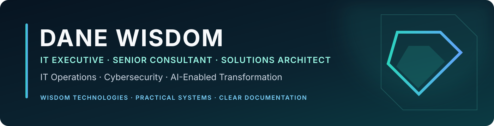

# Hi, I'm Dane Wisdom

**IT Executive · Senior Consultant · Solutions Architect · Founder, Wisdom Technologies**

I design, modernize, and operationalize dependable technology systems. My work spans IT advisory, cloud and infrastructure, cybersecurity, networking, automation, software engineering, AI-enabled workflows, and technical documentation.

## What I’m building

- **[Wisdom IT Readiness Toolkit](https://github.com/danwiz/wisdom-it-readiness-toolkit)** — an open-source assessment toolkit with weighted scoring, maturity classification, Markdown reporting, validation, tests, CI, and packaged CLI workflows
- **[Sports Management System — Legacy C++ Preservation & Modernization](https://github.com/danwiz/sports-management-system-legacy)** — a released C++20 preservation and modernization case study with seven regression suites, provenance controls, explicit licensing boundaries, and reproducible release packaging
- **[Enterprise Computing II — Legacy Distributed .NET Recovery & Modernization](docs/ecii-modern/CASE-STUDY.md)** — an evidence-driven reconstruction and .NET 8 reference implementation with payment orchestration, idempotency, reconciliation, EF Core migrations, automated tests, security hardening, SBOM generation, containerization, and verified v1.0.0 release engineering
- Reusable engineering standards, templates, reference implementations, and knowledge systems
- Practical tools for IT operations, cloud, cybersecurity, automation, and digital workplaces

## Core capabilities

`IT Consulting` · `Solutions Architecture` · `Cloud & Infrastructure` · `Cybersecurity` · `Networking` · `Automation` · `Software Engineering` · `AI-Enabled Transformation` · `Technical Writing`

## How I work

- Start with the operating problem, the people affected, and the evidence available
- Make security, maintainability, documentation, and rollback part of the design
- Favor practical systems that teams can understand, operate, and improve
- Turn successful delivery patterns into reusable assets and clear guidance

## Selected experience

- Supported enterprise workstation and user migrations across multiple financial-services and healthcare engagements
- Strengthened recovery readiness, operational continuity, and support processes across varied client environments
- Delivered multi-site technology modernization, troubleshooting, documentation, and service-improvement work

## Selected releases

- **[Wisdom IT Readiness Toolkit v0.1.0](https://github.com/danwiz/wisdom-it-readiness-toolkit/releases/tag/v0.1.0)** — validated installation, scoring, report generation, report validation, tests, and artifact upload
- **[Sports Management System v0.10.0](https://github.com/danwiz/sports-management-system-legacy/releases/tag/v0.10.0)** — governed legacy preservation and C++20 modernization release with regression validation and explicit provenance boundaries
- **[ECII Modern Reference Architecture v1.0.0](docs/ecii-modern/RELEASE-v1.0.0.md)** — verified .NET 8 final release with 36/36 automated tests passing, EF Core migration generation plus rollback/forward replay, clean dependency-vulnerability audit, CycloneDX SBOM, successful publish and Docker build, healthy container probes, OIDC authorization hardening, and retained provenance boundaries

## Repository governance

Older upstream libraries and tutorial copies are being classified and marked with explicit provenance notices. They are retained only as historical learning references and are not presented as original portfolio work. See [portfolio audit issue #16](https://github.com/danwiz/danwiz/issues/16).

## Connect

- Portfolio: [danwiz.github.io/danwiz](https://danwiz.github.io/danwiz/)
- GitHub: [@danwiz](https://github.com/danwiz)
- X: [@DaneWisdom](https://x.com/DaneWisdom)
- Email: [danewisdom@gmail.com](mailto:danewisdom@gmail.com)
- Company: Wisdom Technologies

---

> Building dependable technology systems, useful tools, and clear documentation.
